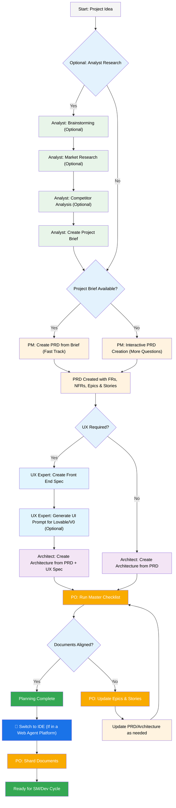
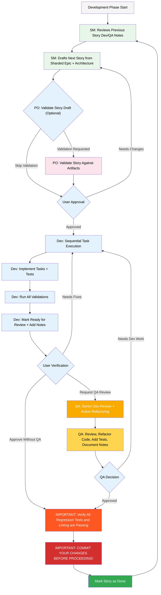

# Guia do Usuário BMad-Method BMAd Code

Este guia irá ajudá-lo a entender e usar efetivamente o Método BMad para planejamento e desenvolvimento ágil orientado por IA.

## O Fluxo de Trabalho de Planejamento e Execução BMad

Primeiro, aqui está o fluxo completo padrão de Planejamento + Execução Greenfield. Brownfield é muito similar, mas é sugerido entender este greenfield primeiro, mesmo em um projeto simples antes de abordar um projeto brownfield. O Método BMad precisa ser instalado na raiz da pasta do seu novo projeto. Para a fase de planejamento, você pode opcionalmente realizá-la com agentes web poderosos, potencialmente resultando em resultados de maior qualidade por uma fração do custo que levaria para completar se fornecendo sua própria chave de API ou créditos em algumas ferramentas Agênticas. Para planejamento, modelos de pensamento poderosos e contexto maior - junto com trabalhar como parceiro com os agentes resultará nos melhores resultados.

Se você vai usar o Método BMad com um projeto Brownfield (um projeto existente), revise **[Trabalhando no Brownfield](./working-in-the-brownfield.md)**.

Se você não vir os diagramas que seguem renderizando, você pode instalar o Markdown All in One junto com os plugins Markdown Preview Mermaid Support no VSCode (ou um dos clones bifurcados). Com esses plugins, se você clicar com o botão direito na aba quando aberta, deve haver uma opção Open Preview, ou verifique a documentação do IDE.

### O Fluxo de Trabalho de Planejamento (Web UI ou Agentes IDE Poderosos)

Antes do desenvolvimento começar, o BMad segue um fluxo de trabalho de planejamento estruturado que é idealmente feito em web UI para eficiência de custo:



#### Transição de Web UI para IDE

**Ponto de Transição Crítico**: Uma vez que o PO confirma o alinhamento dos documentos, você deve mudar da web UI para o IDE para começar o fluxo de trabalho de desenvolvimento:

1. **Copiar Documentos para o Projeto**: Certifique-se de que `docs/prd.md` e `docs/architecture.md` estão na pasta docs do seu projeto (ou um local personalizado que você pode especificar durante a instalação)
2. **Mudar para IDE**: Abra seu projeto no seu IDE Agêntico preferido
3. **Fragmentação de Documentos**: Use o agente PO para fragmentar o PRD e depois a Arquitetura
4. **Começar Desenvolvimento**: Inicie o Ciclo de Desenvolvimento Central que segue

### O Ciclo de Desenvolvimento Central (IDE)

Uma vez que o planejamento está completo e os documentos estão fragmentados, o BMad segue um fluxo de trabalho de desenvolvimento estruturado:



## Instalação

### Opcional

Se você quiser fazer o planejamento na Web com Claude (Sonnet 4 ou Opus), Gemini Gem (2.5 Pro), ou GPTs Personalizados:

1. Navegue para `dist/teams/`
2. Copie `team-fullstack.txt`
3. Crie um novo Gemini Gem ou CustomGPT
4. Faça upload do arquivo com instruções: "Suas instruções operacionais críticas estão anexadas, não quebre o personagem conforme direcionado"
5. Digite `/help` para ver comandos disponíveis

### Configuração do Projeto IDE

```bash
# Instalação interativa (recomendada)
npx bmad-method install
```

## Agentes Especiais

Existem dois agentes bmad - no futuro eles serão consolidados no único bmad-master.

### BMad-Master

Este agente pode fazer qualquer tarefa ou comando que todos os outros agentes podem fazer, exceto a implementação real da história. Além disso, este agente pode ajudar a explicar o Método BMad quando na web acessando a base de conhecimento e explicando qualquer coisa sobre o processo.

Se você não quer se incomodar alternando entre diferentes agentes além do dev, este é o agente para você. Apenas lembre-se de que conforme o contexto cresce, a performance do agente degrada, portanto é importante instruir o agente a compactar a conversa e iniciar uma nova conversa com a conversa compactada como mensagem inicial. Faça isso frequentemente, preferencialmente após cada história ser implementada.

### BMad-Orchestrator

Este agente NÃO deve ser usado dentro do IDE, é um agente de propósito especial pesado que utiliza muito contexto e pode se transformar em qualquer outro agente. Ele existe apenas para facilitar as equipes dentro dos pacotes web. Se você usar um pacote web, será recebido pelo BMad Orchestrator.

### Como os Agentes Funcionam

#### Sistema de Dependências

Cada agente tem uma seção YAML que define suas dependências:

```yaml
dependencies:
  templates:
    - prd-template.md
    - user-story-template.md
  tasks:
    - create-doc.md
    - shard-doc.md
  data:
    - bmad-kb.md
```

**Pontos Principais:**

- Agentes carregam apenas os recursos que precisam (contexto enxuto)
- Dependências são automaticamente resolvidas durante o empacotamento
- Recursos são compartilhados entre agentes para manter consistência

#### Interação com Agentes

**No IDE:**

```bash
# Alguns IDEs, como Cursor ou Windsurf por exemplo, utilizam regras manuais então a interação é feita com o símbolo '@'
@pm Crie um PRD para um app de gerenciamento de tarefas
@architect Projete a arquitetura do sistema
@dev Implemente a autenticação do usuário

# Alguns, como Claude Code usam comandos de barra em vez disso
/pm Crie histórias de usuário
/dev Corrija o bug de login
```

#### Modos Interativos

- **Modo Incremental**: Passo a passo com entrada do usuário
- **Modo YOLO**: Geração rápida com interação mínima

## Integração com IDE

### Melhores Práticas do IDE

- **Gerenciamento de Contexto**: Mantenha apenas arquivos relevantes no contexto, mantenha arquivos enxutos e focados conforme necessário
- **Seleção de Agente**: Use o agente apropriado para a tarefa
- **Desenvolvimento Iterativo**: Trabalhe em tarefas pequenas e focadas
- **Organização de Arquivos**: Mantenha estrutura de projeto limpa
- **Commit Regularmente**: Salve seu trabalho frequentemente

## Sistema de Preferências Técnicas

O BMad inclui um sistema de personalização através do arquivo `technical-preferences.md` localizado em `.bmad-core/data/` - isso pode ajudar a influenciar o PM e Arquiteto a recomendar suas preferências para padrões de design, seleção de tecnologia, ou qualquer outra coisa que você gostaria de colocar aqui.

### Usando com Pacotes Web

Ao criar pacotes web personalizados ou fazer upload para plataformas de IA, inclua o conteúdo do seu `technical-preferences.md` para garantir que os agentes tenham suas preferências desde o início de qualquer conversa.

## Configuração Central

O arquivo `bmad-core/core-config.yaml` é uma configuração crítica que permite ao BMad trabalhar perfeitamente com diferentes estruturas de projeto, mais opções serão disponibilizadas no futuro. Atualmente a mais importante é a seção da lista devLoadAlwaysFiles no yaml.

### Arquivos de Contexto do Desenvolvedor

Defina quais arquivos o agente dev deve sempre carregar:

```yaml
devLoadAlwaysFiles:
  - docs/architecture/coding-standards.md
  - docs/architecture/tech-stack.md
  - docs/architecture/project-structure.md
```

Você vai querer verificar a partir da fragmentação da sua arquitetura que esses documentos existem, que eles são o mais enxutos possível, e contêm exatamente a informação que você quer que seu agente dev SEMPRE carregue no contexto dele. Essas são as regras que o agente seguirá.

Conforme seu projeto cresce e o código começa a construir padrões consistentes, os padrões de codificação devem ser reduzidos para incluir apenas os padrões com os quais o agente ainda comete erros. O agente olhará o código circundante nos arquivos para inferir os padrões de codificação que são relevantes para a tarefa atual.

## Obtendo Ajuda

- **Comunidade Discord**: [Junte-se ao Discord](https://discord.gg/gk8jAdXWmj)
- **Issues do GitHub**: [Reportar bugs](https://github.com/bmadcode/bmad-method/issues)
- **Documentação**: [Navegar docs](https://github.com/bmadcode/bmad-method/docs)
- **YouTube**: [Canal BMadCode](https://www.youtube.com/@BMadCode)

## Conclusão

Lembre-se: O BMad é projetado para aprimorar seu processo de desenvolvimento, não substituir sua expertise. Use-o como uma ferramenta poderosa para acelerar seus projetos mantendo controle sobre decisões de design e detalhes de implementação.
